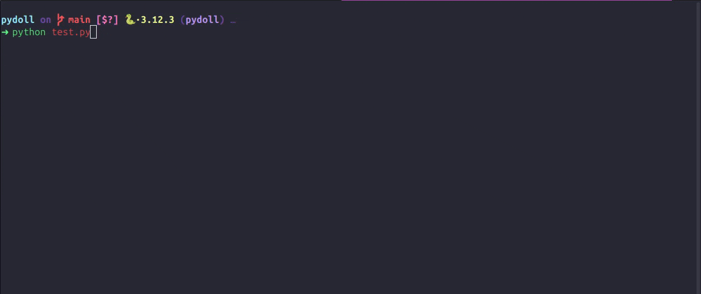
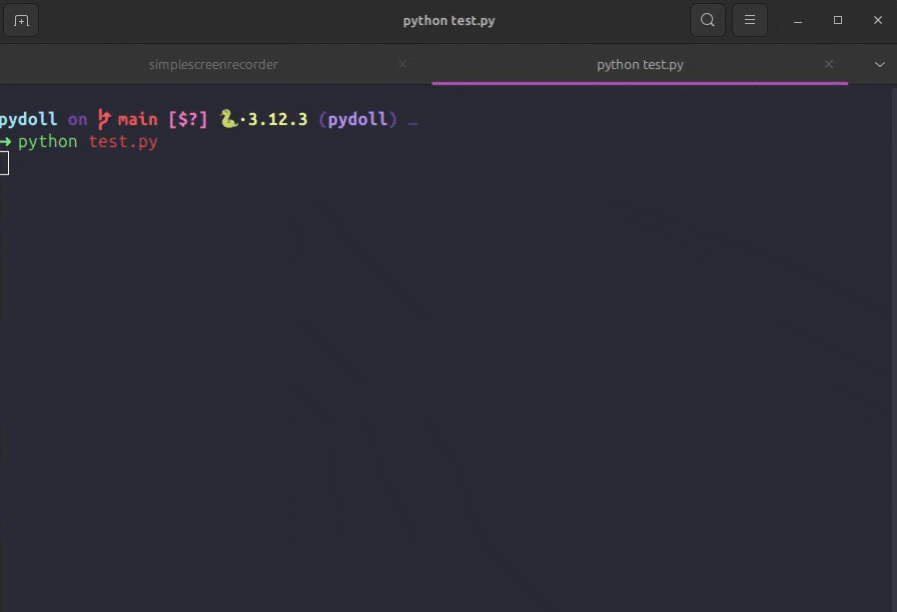

<p align="center">
     <br>
</p>
<h1 align="center">Pydoll: Automate the Web, Naturally</h1>

<p align="center">
    <a href="https://codecov.io/gh/autoscrape-labs/pydoll" >
        
    </a>
    
    
    
    = 3.10">
    <a href="https://deepwiki.com/autoscrape-labs/pydoll"></a>
</p>


<p align="center">
  📖 <a href="https://autoscrape-labs.github.io/pydoll/">Documentation</a> •
  🚀 <a href="#getting-started">Getting Started</a> •
  ⚡ <a href="#advanced-features">Advanced Features</a> •
  🤝 <a href="#contributing">Contributing</a> •
  💖 <a href="#support-my-work">Support My Work</a>
</p>

- [简体中文](README_zh.md)

Imagine the following scenario: you need to automate tasks in your browser. Maybe it's testing a web application, collecting data from a site, or even automating repetitive processes. Normally this involves using external drivers, complex configurations, and many compatibility issues.

**Pydoll was born to solve these problems.**

Built from scratch with a different philosophy, Pydoll connects directly to the Chrome DevTools Protocol (CDP), eliminating the need for external drivers. This clean implementation along with realistic ways of clicking, navigating and interacting with elements makes it practically indistinguishable from a real user.

We believe that powerful automation shouldn't require you to become an expert in configuration or constantly fight with bot protection systems. With Pydoll, you can focus on what really matters: your automation logic, not the underlying complexity or protection systems.

## 🌟 What makes Pydoll special?

- **Zero Webdrivers**: Say goodbye to webdriver compatibility issues
- **Native Captcha Bypass**: Handles Cloudflare Turnstile and reCAPTCHA v3*
- **Asynchronous Performance**: For high-speed automation and multiple simultaneous tasks
- **Humanized Interactions**: Mimic real user behavior
- **Simplicity**: With Pydoll, you install and you're ready to automate.

>⚠️ The effectiveness of captcha bypass depends on various factors, such as IP address reputation. Pydoll can achieve scores comparable to real users, but cannot handle restrictive configurations or IP blocks.

## 📦 Installation

```bash
pip install pydoll-python
```

And that's it! Just install and start automating.

## 🚀 Getting Started

### Your first automation

Let's start with a real example: an automation that performs a Google search and clicks on the first result. With this example, we can see how the library works and how you can start automating your tasks.

```python
import asyncio

from pydoll.browser import Chrome
from pydoll.constants import Key

async def google_search(query: str):
    async with Chrome() as browser:
        tab = await browser.start()
        await tab.go_to('https://www.google.com')
        search_box = await tab.find(tag_name='textarea', name='q')
        await search_box.insert_text(query)
        await search_box.press_keyboard_key(Key.ENTER)
        await (await tab.find(
            tag_name='h3',
            text='autoscrape-labs/pydoll',
            timeout=10,
        )).click()
        await tab.find(id='repository-container-header', timeout=10)

asyncio.run(google_search('pydoll python'))
```

Without configurations, just a simple script, we can do a complete Google search!
Okay, now let's see how we can extract data from a page, using the same previous example.
Let's consider in the code below that we're already on the Pydoll page. We want to extract the following information:

- Project description
- Number of stars
- Number of forks
- Number of issues
- Number of pull requests

Let's get started! To get the project description, we'll use xpath queries. You can check the documentation on how to build your own queries.

```python
description = await (await tab.query(
    '//h2[contains(text(), "About")]/following-sibling::p',
    timeout=10,
)).text
```

And that's it! Let's understand what this query does:

1. `//h2[contains(text(), "About")]` - Selects the first `<h2>` that contains "About"
2. `/following-sibling::p` - Selects the first `<p>` that comes after the `<h2>`

Now let's get the rest of the data:

```python
number_of_stars = await (await tab.find(
    id='repo-stars-counter-star'
)).text

number_of_forks = await (await tab.find(
    id='repo-network-counter'
)).text
number_of_issues = await (await tab.find(
    id='issues-repo-tab-count',
)).text
number_of_pull_requests = await (await tab.find(
    id='pull-requests-repo-tab-count',
)).text

data = {
    'description': description,
    'number_of_stars': number_of_stars,
    'number_of_forks': number_of_forks,
    'number_of_issues': number_of_issues,
    'number_of_pull_requests': number_of_pull_requests,
}
print(data)

```

In the image below we can see the execution speed and the result of the automation.
For demonstration purposes, the browser is not displayed.




In just 5 seconds, we managed to extract all the necessary data! This is the 
speed you can expect from automation with Pydoll.


### A more complex example

Let's now move to a case that you've probably encountered many times: a captcha
like Cloudflare's. Pydoll has a method to try to handle this, although, as mentioned earlier, effectiveness depends on various factors. In the code below, we have a complete example of how to handle a Cloudflare captcha.

```python
import asyncio

from pydoll.browser import Chrome
from pydoll.constants import By

async def cloudflare_example():
    async with Chrome() as browser:
        tab = await browser.start()
        async with tab.expect_and_bypass_cloudflare_captcha():
            await tab.go_to('https://2captcha.com/demo/cloudflare-turnstile')
        print('Captcha handled, continuing...')
        await asyncio.sleep(5)  # just to see the result :)

asyncio.run(cloudflare_example())

```

Below we have the result of the execution:


With just a few lines of code, we managed to handle one of the most
difficult captchas to deal with. This is just one of the many functionalities that Pydoll
offers. But it doesn't stop there!


### Custom Configurations

Sometimes we need more control over the browser. Pydoll offers a flexible way to do this. Let's see the example below:


```python
from pydoll.browser import Chrome
from pydoll.browser.options import ChromiumOptions as Options

async def custom_automation():
    # Configure browser options
    options = Options()
    options.add_argument('--proxy-server=username:password@ip:port')
    options.add_argument('--window-size=1920,1080')
    options.binary_location = '/path/to/your/browser'

    async with Chrome(options=options) as browser:
        tab = await browser.start()
        # Your automation code here
        await tab.go_to('https://example.com')
        # The browser is now using your custom settings

asyncio.run(custom_automation())
```

In this example, we're configuring the browser to use a proxy and a 1920x1080 window, in addition to a custom path for the Chrome binary, in case your installation location is different from the common defaults.


## ⚡ Advanced Features

Pydoll offers a series of advanced features to please even the most
demanding users.


### Advanced Element Search

We have several ways to find elements on the page. No matter how you prefer, we have a way that makes sense for you:

```python
import asyncio
from pydoll.browser import Chrome

async def element_finding_examples():
    async with Chrome() as browser:
        tab = await browser.start()
        await tab.go_to('https://example.com')

        # Find by attributes (most intuitive)
        submit_btn = await tab.find(
            tag_name='button',
            class_name='btn-primary',
            text='Submit'
        )
        # Find by ID
        username_field = await tab.find(id='username')
        # Find multiple elements
        all_links = await tab.find(tag_name='a', find_all=True)
        # CSS selectors and XPath
        nav_menu = await tab.query('nav.main-menu')
        specific_item = await tab.query('//div[@data-testid="item-123"]')
        # With timeout and error handling
        delayed_element = await tab.find(
            class_name='dynamic-content',
            timeout=10,
            raise_exc=False  # Returns None if not found
        )
        # Advanced: Custom attributes
        custom_element = await tab.find(
            data_testid='submit-button',
            aria_label='Submit form'
        )

asyncio.run(element_finding_examples())
```

The `find` method is more user-friendly. We can search by common attributes like id, tag_name, class_name, etc., up to custom attributes (e.g. `data-testid`).

If that's not enough, we can use the `query` method to search for elements using CSS selectors, XPath queries, etc. Pydoll automatically takes care of identifying what type of query we're using.


### Concurrent Automation

One of the great advantages of Pydoll is the ability to process multiple tasks simultaneously thanks to its asynchronous implementation. We can automate multiple tabs
at the same time! Let's see an example:

```python
import asyncio
from pydoll.browser import Chrome

async def scrape_page(url, tab):
    await tab.go_to(url)
    title = await tab.execute_script('return document.title')
    links = await tab.find(tag_name='a', find_all=True)
    return {
        'url': url,
        'title': title,
        'link_count': len(links)
    }

async def concurrent_scraping():
    browser = Chrome()
    tab_google = await browser.start()
    tab_duckduckgo = await browser.new_tab()
    tasks = [
        scrape_page('https://google.com/', tab_google),
        scrape_page('https://duckduckgo.com/', tab_duckduckgo)
    ]
    results = await asyncio.gather(*tasks)
    print(results)
    await browser.stop()

asyncio.run(concurrent_scraping())
```

Below we see the incredible execution speed:




We managed to extract data from two pages at the same time! Tell me if that's not incredible?


And there's much, much more! Event system for reactive automations, request interception and modification, and so on. Take a look at the documentation, you won't
regret it!


## 🔧 Quick Troubleshooting

**Browser not found?**
```python
from pydoll.browser import Chrome
from pydoll.browser.options import ChromiumOptions

options = ChromiumOptions()
options.binary_location = '/path/to/your/chrome'
browser = Chrome(options=options)
```

**Need a proxy?**
```python
options.add_argument('--proxy-server=your-proxy:port')
```

**Running in Docker?**
```python
options.add_argument('--no-sandbox')
options.add_argument('--disable-dev-shm-usage')
```

## 📚 Documentation

For complete documentation, detailed examples and deep dives into all Pydoll functionalities, visit our [official documentation](https://autoscrape-labs.github.io/pydoll/).

The documentation includes:
- **Getting Started Guide** - Step-by-step tutorials
- **API Reference** - Complete method documentation
- **Advanced Techniques** - Network interception, event handling, performance optimization

## 🤝 Contributing

We would love your help to make Pydoll even better! Check out our [contribution guidelines](CONTRIBUTING.md) to get started. Whether it's fixing bugs, adding features or improving documentation - all contributions are welcome!

Please make sure to:
- Write tests for new features or bug fixes
- Follow code style and conventions
- Use conventional commits for pull requests
- Run lint checks and tests before submitting

## 💖 Support My Work

If you find Pydoll useful, consider [supporting me on GitHub](https://github.com/sponsors/thalissonvs).  
You'll get access to exclusive benefits like priority support, custom features and much more!

Can't sponsor right now? No problem — you can still help a lot by:
- Starring the repository
- Sharing on social media
- Writing posts or tutorials
- Giving feedback or reporting issues

Every bit of support makes a difference — thank you!

## 📄 License

Pydoll is licensed under the [MIT License](LICENSE).

<p align="center">
  <b>Pydoll</b> — Making browser automation magical!
</p>
